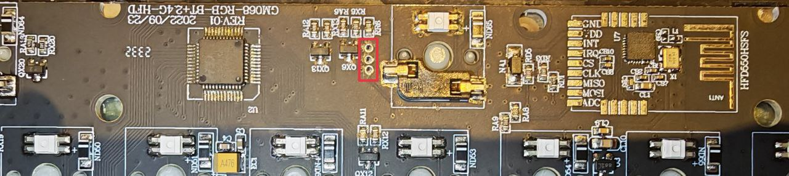

# Zuoya GMK67 (HFD801KJC) Recovery & Flasher

A specialized utility for flashing and recovering the Zuoya GMK67 keyboard. This tool can restore the original firmware even if the device is in a bootloader (Microdia) state or has non-standard HID configurations.

> [!CAUTION]
> **DISCLAIMER:** Use this tool at your own risk. I am not responsible for any damage, data loss, or "bricked" hardware resulting from the use of this software. Hardware modifications and firmware flashing always carry a risk.

## Features
- **Recovery Mode:** Can recover the keyboard from the `0c45:7040` (**Microdia**) PID/VID state.
- **Factory Reset:** Resets all settings if the keyboard is recognized as `05ac:024f` but behaves incorrectly due to non-standard configuration.
- **Sequential Flashing:** Handles complex multi-stage firmware deployments from `.pkg` files.

## Prerequisites
- **Connection:** YOU MUST USE A **WIRED USB CONNECTION**. Do not attempt to flash over 2.4GHz or Bluetooth.
- **Package File:** Requires `recovery.pkg` in the same directory.

## Installation

### Dependencies by OS

#### 🪟 Windows
1. Install [Python 3.x](https://www.python.org/downloads/).
2. Open PowerShell/CMD and run:
   ```bash
   pip install hidapi
   ```

#### 🐧 Linux
1. Install Python and the HIDAPI library (e.g., on Ubuntu/Debian):
   ```bash
   sudo apt update
   sudo apt install python3-pip libhidapi-hidraw0
   pip install hidapi
   ```
2. **Note:** You may need to run the script with `sudo` or setup `udev` rules to access HID devices.

#### 🍎 macOS
1. Install [Homebrew](https://brew.sh/) if not present.
2. Install Python and dependencies:
   ```bash
   brew install hidapi
   pip install hidapi
   ```

## Usage

1. Connect your keyboard via USB.
2. Run the flasher:
   ```bash
   python flasher.py
   ```

---

## Troubleshooting: The Hard Reset (Pin Shorting)

If your keyboard is not detected at all (no LEDs, not showing up in `lsusb` or Device Manager), you may need to force it into the **Microdia** bootloader state manually.

1. **Disassemble** the keyboard case.
2. Locate the specialized recovery pins on the PCB.
3. **Short the two bottom pins together** (they are highlighted in **RED** in the reference photo) while plugging the USB cable in.
4. **Safety Note:** If you short the wrong recovery pins, nothing will happen. The only real risk is accidentally touching other surface-mount components on the PCB, so be precise with your tweezers/wire.
5. The device should now appear as `0c45:7040` (**Microdia**).
6. Run `flasher.py` to restore the firmware.

### Pin Location Reference:


---

## Credits & License
Developed for the community to keep their GMK67s alive.
